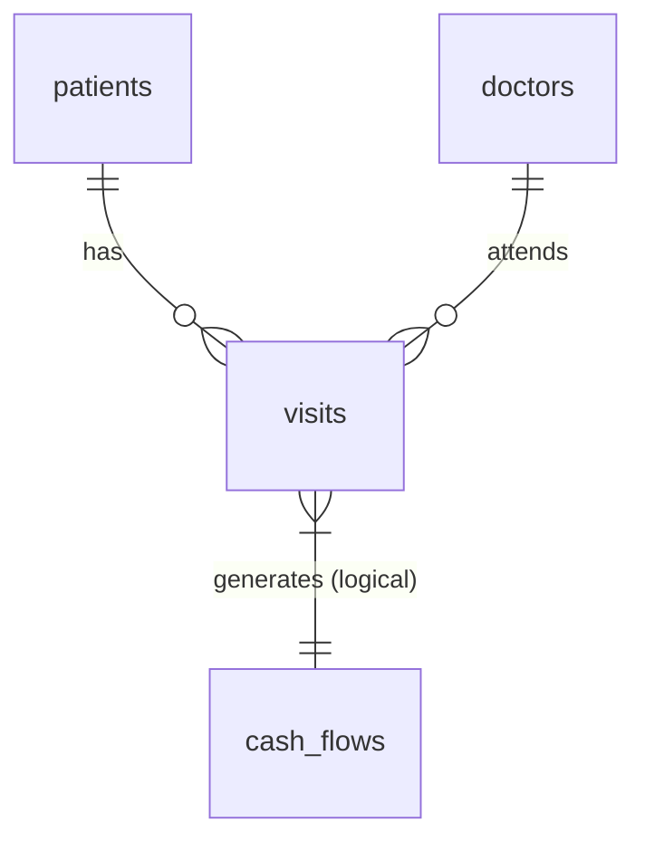

# Data Model

This document explains domain meaning, relationships, ownership, and invariants for the Klinik Cikidang Medika database.

## Entity Map

## Entities

### doctors

Purpose:
Stores information about medical personnel and doctors.

| Field | Meaning | Required | Sensitive? | Rules |
|---|---|---|---|---|
| `id` | UUID PK | Yes | No | |
| `nama` | Name of the doctor | Yes | No | |
| `spesialisasi` | Specialization | No | No | Default 'Dokter Umum' |
| `aktif` | Status | No | No | Default true |

### patients

Purpose:
Master data for clinic patients.

| Field | Meaning | Required | Sensitive? | Rules |
|---|---|---|---|---|
| `id` | UUID PK | Yes | No | |
| `no_rm` | Medical Record Number | Yes | No | UNIQUE |
| `nama` | Patient name | Yes | No | |
| `jenis_kelamin` | Gender | Yes | No | |
| `desa` | Village | Yes | No | |
| `no_ktp` | NIK | No | Yes | |
| `no_bpjs` | BPJS Number | No | Yes | |

### visits

Purpose:
Records patient visits, medical records, and billing.

| Field | Meaning | Required | Sensitive? | Rules |
|---|---|---|---|---|
| `id` | UUID PK | Yes | No | |
| `pasien_id` | FK to patients | Yes | No | CASCADE delete |
| `dokter_id` | FK to doctors | No | No | SET NULL delete |
| `tanggal_periksa`| Date of visit | Yes | No | |
| `jenis_pasien` | UMUM or BPJS | Yes | No | Default 'UMUM' |
| `biaya_periksa` | Examination fee | No | No | Default 0 |
| `kode_icd10` | ICD-10 diagnosis code | No | Yes | |

### cash_flows

Purpose:
Operational cash flow records (income and expenses).

| Field | Meaning | Required | Sensitive? | Rules |
|---|---|---|---|---|
| `id` | UUID PK | Yes | No | |
| `tanggal` | Date of cash flow | Yes | No | |
| `jenis` | Masuk or Keluar | Yes | No | |
| `nominal` | Amount | Yes | No | Default 0 |

### Planned Future Entities (F-007)
- **TBC Cohort Tracking:** For monitoring TBC patients over 6 months.
- **Circumcision Records:** For storing post-care progress and photo storage links.
- **Post-Care Monitoring:** General post-treatment follow-ups.

## Invariants

- `no_rm` in the `patients` table must be UNIQUE.
- `biaya_periksa` defaults to 0 for BPJS patients.

## Relationships

| Relationship | Cardinality | Delete behavior |
|---|---|---|
| visits -> patients | Many-to-One | CASCADE |
| visits -> doctors | Many-to-One | SET NULL |

## Access Control Summary

| Entity | Read | Create | Update | Delete |
|---|---|---|---|---|
| patients | kasir, dokter, owner | kasir, owner | kasir, owner | owner |
| visits | kasir, dokter, owner | kasir, dokter, owner | kasir, dokter, owner | owner |
| doctors | all roles | owner | owner | owner |
| cash_flows | owner | owner | owner | owner |

## Query and Index Expectations

- `patients`: Indexed on `no_rm` and `nama` for <100ms search.
- `visits`: Indexed on `tanggal_periksa`, `pasien_id`, and `kode_icd10`.
- `cash_flows`: Indexed on `tanggal`.
