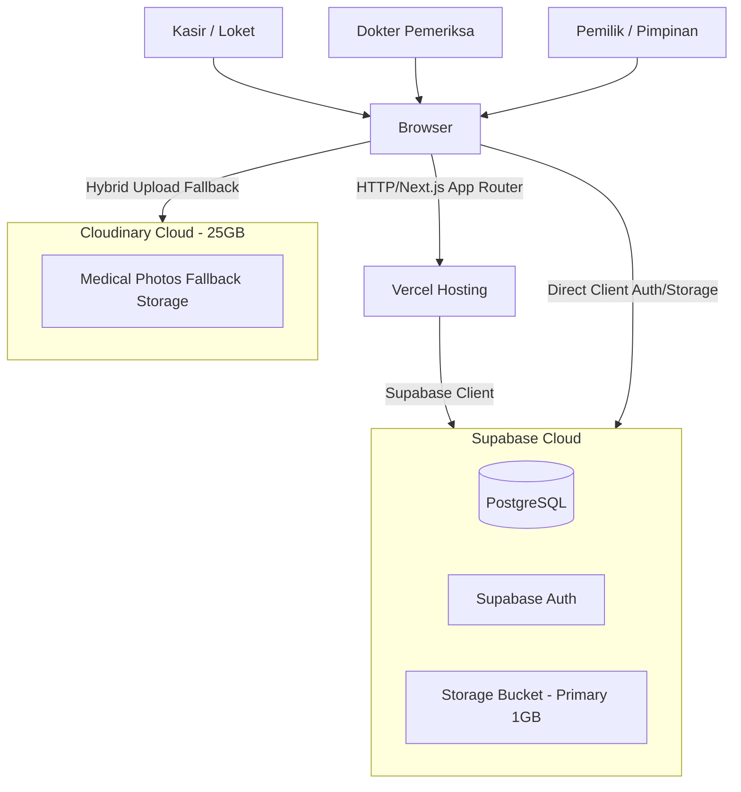

# Architecture Overview

## 1. System Purpose

Sistem Informasi Manajemen (SIM) Klinik Pratama Cikidang Medika is a web-based clinic management system designed for patient registration, medical records, billing, and cash flow reporting. The system replaces manual Google Sheets tracking, offering robust data integrity, mobile accessibility, and rapid data entry workflows. It handles core clinical operations while excluding external integrations like BPJS P-Care or detailed pharmacy inventory lot tracking.

## 2. Architecture Drivers

- High data volume and integrity needs (migrating 7,493 visits, 4,238 patients).
- Fast data entry (cashier registration under 30 seconds).
- Mobile accessibility for clinic owners to monitor cash flows and metrics.
- Zero maintenance cost requirement (leveraging Free Tiers: Vercel, Supabase, Cloudinary).
- Atomic UI design system with reusable UI primitives and centralized domain constants.

## 3. System Context



Actors and systems:

| System / Actor | Purpose | Data exchanged | Failure impact |
|---|---|---|---|
| Kasir | Patient registration and billing | Patient identity, visits, payments | Delays in patient queuing |
| Dokter | Medical examinations | Diagnoses (ICD-10), treatments, photos | Disruption to medical records |
| Pemilik | Operational monitoring | Cash flows, metrics, reports | Delayed financial decisions |
| Browser | Untrusted client environment | UI interactions, client-side WebP compression | Loss of access |
| Vercel | Frontend hosting (Next.js 14) | SSR and API routes | App unavailability |
| Supabase | Backend (Database, Auth, Storage) | SQL data, Auth tokens, Primary photos | Complete system halt |
| Cloudinary | Secondary media storage (25GB tier) | Circumcision & post-care compressed WebP photos | Fallback to primary storage |

## 4. Major Components

| Component | Responsibility | Owns | Must not own |
|---|---|---|---|
| `src/app/` | Routing, SSR, presentation | UI logic, layouts, route handlers | Direct raw SQL queries |
| `src/components/ui/` | Atomic reusable UI primitives | Button, Badge, Modal, Input, Select, Card | Domain business logic, direct Supabase calls |
| `src/components/` | Domain-specific feature modules | PatientSearchAutocomplete, Registration Modals | Direct raw schema definitions |
| `src/constants/` | Canonical constants & theme tokens | Clinic profile, village list, default tariffs, theme | State or mutating logic |
| `src/lib/storage.ts` | Hybrid media storage adapter | Client WebP compression (< 300KB), Supabase/Cloudinary fallback | UI rendering |
| `src/lib/supabase/` | Database client config | Supabase client instances (browser/server) | UI components |
| `src/types/` | Domain models and schema types | TypeScript definitions | Implementations |

## 5. Dependency Direction

```text
Presentation (src/app/)
  └── Feature Components (src/components/pendaftaran/, etc.)
       └── Reusable UI Primitives (src/components/ui/)
            └── Constants & Tokens (src/constants/)
                 └── Domain Types (src/types/)
                      └── Infrastructure (src/lib/storage.ts, src/lib/supabase/)
```

Rules:

1. Inner layers must not import framework-specific outer layers.
2. Feature pages and domain components MUST consume reusable UI primitives from `src/components/ui/` and constants from `src/constants/`.
3. Infrastructure errors must be normalized before reaching presentation.
4. Authorization must be enforced at a trusted boundary (Supabase RLS).
5. Cross-feature shared code requires a stable, domain-neutral contract.

## 6. Deployment & Storage Topology

- Client runtime: Browser (Web/Mobile)
- Application hosting: Vercel Free Tier (auto-deploy from Git)
- Database region: Supabase Cloud (PostgreSQL with RLS)
- Primary Media Storage: Supabase Storage (`medical-photos`, 1GB private bucket with signed URLs)
- Secondary / Fallback Media Storage: Cloudinary (25GB free tier, client-side WebP compression < 300KB)
- Authentication: Supabase Auth (RBAC: `kasir`, `dokter`, `owner`)

## 7. Quality Attributes

| Attribute | Required behavior | Verification |
|---|---|---|
| Performance | Search response < 100ms | Client-side profiling and Supabase logs |
| Performance | Page load < 1.5s | Lighthouse score > 90 |
| Reusability | 100% shared UI primitives | Components in `src/components/ui/` reused across modules |
| Storage Efficiency | Medical photos < 300KB WebP | `compressImageToWebP` before upload |
| Security | Role-based data access & signed URLs | RLS policy tests & signed URL TTL |
