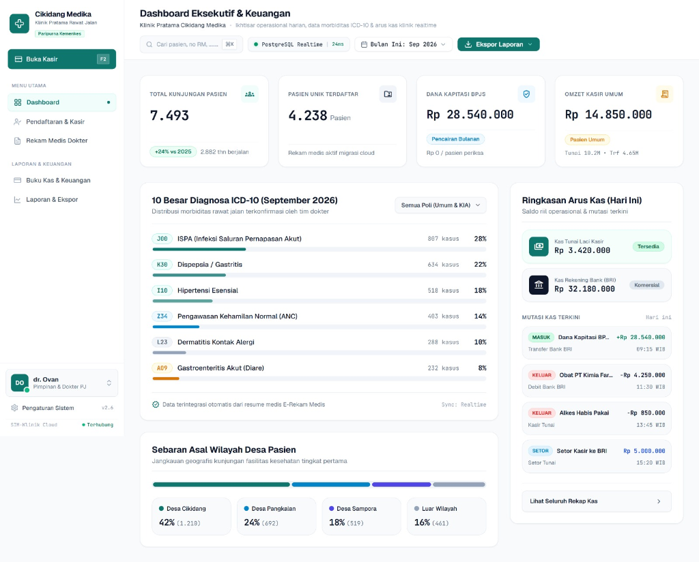

# PROPOSAL PENGEMBANGAN SISTEM INFORMASI MANAJEMEN KLINIK
## KLINIK PRATAMA CIKIDANG MEDIKA

**Diajukan Kepada:** dr. Ovan / dr. Neneng / Pimpinan Klinik Cikidang Medika  
**Disusun Oleh:** Tim Pengembang Sistem Informasi & Rekayasa Perangkat Lunak  
**Tanggal Pengajuan:** 18 September 2026  
**Masa Berlaku Penawaran:** 7 Hari Kalender (hingga 25 September 2026)  

---

## 1. Executive Summary

Proposal ini menjabarkan rencana pembangunan **Sistem Informasi Manajemen (SIM) Klinik Berbasis Website** untuk Klinik Pratama Cikidang Medika. Sistem ini dirancang untuk menggantikan pembukuan manual Google Sheets yang saat ini telah menampung lebih dari **7.400 riwayat transaksi pasien**, menjadi sistem database cloud terpadu yang aman, cepat, dan mudah dioperasikan.

Melalui sistem ini, seluruh data pendaftaran pasien, rekam medis harian dokter, transaksi kasir, serta pembukuan kas operasional (termasuk pencairan dana Kapitasi BPJS bulanan) terkumpul rapi di satu tempat terpusat yang dapat diakses secara fleksibel melalui laptop di klinik maupun ponsel dokter/pemilik saat bertugas di luar.

**Keunggulan Utama Solusi:**
- **Bebas Biaya Pemeliharaan Server:** Biaya sewa server cloud database adalah **Rp 0 / Bulan (Gratis Selamanya)**.
- **Penyelamatan 100% Data Lama:** Sebanyak **7.493 catatan kunjungan dan 4.238 pasien terdaftar** dari spreadsheet lama dipindahkan otomatis ke sistem baru.
- **Nama Domain Resmi Klinik:** Menggunakan alamat website milik klinik sendiri (contoh: `www.klinikcikidangmedika.com`).
- **Waktu Pengerjaan Cepat:** Siap diserahterimakan dalam **4 hingga 6 Hari Kerja**.

---

## 2. Pratinjau Desain Antarmuka Sistem (Mockup Visual)

Berikut adalah visualisasi nyata (*high-fidelity prototype*) antarmuka sistem yang telah disiapkan secara khusus menggunakan data riil historis Klinik Cikidang Medika:

*Gambar 1: Antarmuka Dashboard Eksekutif & Finansial Klinik Cikidang Medika — Memuat 7.493 kunjungan, omzet kasir, dana kapitasi BPJS, 10 besar penyakit ICD-10, dan pemantauan kas fisik vs bank.*

---

## 3. Analisis Kebutuhan & Masalah Operasional

### Kondisi Saat Ini
Klinik Cikidang Medika telah beroperasi aktif dengan volume kunjungan yang terus tumbuh pesat:
- **Tahun 2023:** 595 kunjungan pasien.
- **Tahun 2024:** 1.730 kunjungan pasien (+191%).
- **Tahun 2025:** 2.286 kunjungan pasien (+32%).
- **Tahun 2026 (s/d September):** 2.882 kunjungan pasien.
- **Total Akumulasi Kunjungan:** **7.493 transaksi** dengan **4.238 pasien unik**.

### Tantangan & Risiko Spreadsheet Manual
1. **Redundansi Input Pasien Berulang:** Karena pasien kontrol berulang kali, staf loket harus mengetik ulang identitas yang sama. Akibatnya terjadi inkonsistensi data (57% data NIK dan 64% data BPJS kosong).
2. **Risiko Kerusakan Formula & Sel:** Pada volume 7.500 baris, spreadsheet rawan sel tertimpa yang dapat merusak rekapan omzet kasir dan rumus pivot.
3. **Keterbatasan Akses Mobile:** Pemilik klinik kesulitan memantau arus kas dan tren pasien dari luar klinik karena file spreadsheet berukuran besar lambat dibuka di smartphone.

---

## 4. Ruang Lingkup Sistem & Rincian Modul

### Modul 1: Pendaftaran Pasien & Kasir Loket (Front-Office)
- **Pencarian Cepat Pasien Lama:** Ketik Nama atau No RM, identitas pasien langsung muncul tanpa perlu input ulang (mengeliminasi input dobel).
- **Pendaftaran Pasien Baru:** Formulir standar untuk pasien pertama kali datang (Nama, Gelar, Tgl Lahir, Desa, NIK, No BPJS).
- **Billing & Kasir Transaksi:**
  - **Pasien BPJS:** Biaya periksa otomatis tercatat Rp 0 (karena masuk klaim kapitasi bulanan).
  - **Pasien Umum:** Input biaya periksa/tindakan, pilih cara bayar (Tunai / Transfer Bank).
  - **Cetak Bukti Pembayaran:** Kuitansi/nota kasir dapat langsung dicetak untuk pasien.

### Modul 2: Rekam Medis Ringkas Dokter (dr. Ovan & dr. Neneng)
- **Antrean Periksa Real-time:** Dokter melihat daftar pasien yang sedang mengantre pada hari berjalan.
- **Catatan Pemeriksaan:** Dokter mencatat keluhan utama (anamnesa), tanda vital, memilih diagnosa ICD-10 praktis (J00 ISPA, K30 Maag, Z34 Kehamilan, dll), dan resep obat/tindakan yang diberikan.
- **Riwayat Berobat:** Dokter dapat melihat riwayat kunjungan pasien sebelumnya untuk memantau perkembangan kesehatan pasien.

### Modul 3: Buku Kas Operasional & Kapitasi BPJS
- **Pencatatan Kas Masuk:** Pencairan dana Kapitasi bulanan BPJS Kesehatan (~Rp 28 Juta/bulan), rujukan USG, dan lab.
- **Pencatatan Kas Keluar:** Pembelian obat-obatan klinik, alat medis habis pakai, serta operasional harian (konsumsi dokter/staf, listrik, kebersihan).
- **Rekap Setor Tunai:** Mencatat uang tunai yang disetorkan kasir ke bank agar buku kas fisik klinik dan rekening bank selalu seimbang.

### Modul 4: Dashboard Eksekutif & Ekspor Excel
- **Visualisasi Omzet & Kunjungan:** Kartu metrik total pasien, pendapatan tunai vs transfer, estimasi dana kapitasi, dan pengeluaran.
- **Analitik 10 Besar Penyakit:** Grafik tren penyakit yang paling sering ditangani klinik sebagai bahan laporan medis berkala.
- **Ekspor Excel (.xlsx) 1-Klik:** Seluruh rekapan kunjungan dan keuangan dapat diunduh ke Excel kapan saja hanya dengan satu klik.

### Modul 5: Register & Laporan Program Khusus (Fitur Tambahan Terpilih)
- **Kartu Kendali Pasien TBC (Tuberkulosis):**
  - Pemantauan kepatuhan minum obat (OAT) selama 6 bulan (Fase Intensif Bulan 1-2 & Fase Lanjutan Bulan 3-6).
  - Indikator otomatis untuk mendeteksi pasien yang jatuh tempo kontrol dan pasien mangkir/terlambat.
- **Layanan Sunat (Sirkumsisi) & Dokumentasi Foto Pasca Sunat:**
  - Pencatatan tindakan sunat (tanggal tindakan, metode/alat sunat, operator medis).
  - Fitur unggah foto dokumentasi luka kontrol pasca sunat (maksimal 2 foto terkompresi otomatis < 300KB per pasien) yang disimpan di server cloud privat khusus medis berkeamanan tinggi.
- **Pemantauan Pasien Pos-Rawat:**
  - Register pemantauan pasien pasca rawat inap/operasi/rujukan balik untuk memastikan jadwal kontrol lanjutan di klinik terlaksana tepat waktu.

---

## 5. Batasan Ruang Lingkup

| Termasuk dalam Layanan (In-Scope) | Dikecualikan (Out-of-Scope) |
| :--- | :--- |
| **5 Modul Web** (Pendaftaran, Dokter, Kas, Dashboard, Program Khusus TBC/Sunat/Pos-Rawat) | Bridging API P-Care BPJS (dinyatakan tidak dibutuhkan) |
| Penyimpanan aman cloud foto pasca sunat (maks. 2 foto terkompresi/pasien) | **Stok Penjualan Retail Skincare (Emerys Glow)** — *Ditunda sesuai arahan dokter* |
| Migrasi otomatis 7.493 data CSV lama ke database | Manajemen stok obat per butir apotek (sudah ada di sistem RME dokter) |
| Setup nama domain resmi klinik & sertifikat SSL | Antrean tiket suara display TV poli |
| Panduan penggunaan & pendampingan awal staf | Modul rawat inap (klinik berstatus rawat jalan) |

---

## 6. Nilai Investasi & Skema Pembayaran

| Komponen Investasi | Nilai Biaya | Ketentuan Pembayaran |
| :--- | :--- | :--- |
| **Total Biaya Pembangunan Sistem (Termasuk Modul Khusus)** | **Rp 2.500.000 (Bersih)** | Mencakup 5 modul aplikasi web, modul foto sunat aman, migrasi 7.400+ data lama, dan garansi teknis. |
| **Tahap 1: Uang Muka (DP 50%)** | **Rp 1.250.000** | Dibayarkan saat proposal disetujui untuk memulai pengerjaan teknis. |
| **Tahap 2: Pelunasan (50%)** | **Rp 1.250.000** | Dibayarkan setelah sistem selesai diuji coba dan data lama selesai dimigrasi. |
| **Biaya Server Cloud Rutin** | **Rp 0 / Bulan (Gratis)** | Menggunakan cloud database & storage resmi berkapasitas besar bebas biaya bulanan. |
| **Biaya Nama Domain Resmi** | **~Rp 150rb - 250rb / Tahun** | Dibayarkan langsung oleh pihak klinik ke penyedia domain resmi Indonesia. |

---

## 7. Jadwal Pelaksanaan & Tahapan Kerja (Timeline)

Proyek diselesaikan dalam rentang waktu **5 hingga 7 Hari Kerja**:

- **Hari 1:** Setup database cloud, storage bucket aman, & migrasi 7.493 data historis dari spreadsheet
- **Hari 2:** Pembangunan Modul 1 (Pendaftaran Pasien & Kasir Loket)
- **Hari 3:** Pembangunan Modul 2 (Rekam Medis Dokter) & Modul 3 (Buku Kas)
- **Hari 4:** Pembangunan Modul 5 (Register Program Khusus: TBC 6 Bulan, Layanan Sunat + Unggah Foto, Pos-Rawat)
- **Hari 5:** Pembangunan Modul 4 (Dashboard Analitik & Fitur Ekspor Excel)
- **Hari 6:** Pengujian menyeluruh alur kasir, keamanan foto medis, & penyambungan domain klinik
- **Hari 7:** Serah terima sistem, uji coba staf klinik, dan pelunasan tahap 2

---

## 8. Langkah Selanjutnya (Next Steps)

1. Pihak dokter/manajemen klinik meninjau dan menyetujui dokumen proposal ini beserta pratinjau desain.
2. Melakukan transfer pembayaran uang muka (DP 50% sebesar Rp 1.250.000).
3. Tim pengembang langsung memulai proses migrasi data dan konfigurasi sistem pada hari yang sama.