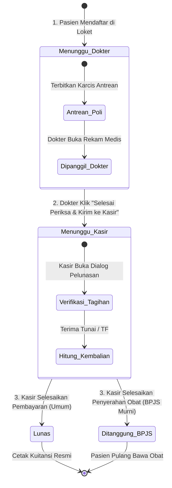
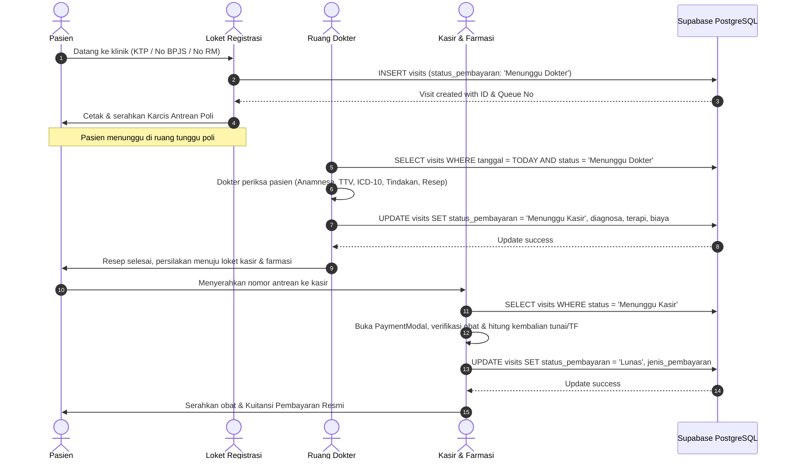

# Technical Design: F-002 Rekam Medis Ringkas Dokter & Alur Pelayanan

## 1. Arsitektur State Machine & Alur Antrean (Lifecycle State Machine)

Untuk mengeliminasi kartu antrean ganda (*redundant cards*) yang sebelumnya muncul di dua tab sekaligus, sistem menetapkan mesin status linier yang saling lepas (*mutually exclusive*) pada kolom `public.visits.status_pembayaran`:



### Pemetaan Status ke Tab Halaman `/pendaftaran`:

| Status Kunjungan | Tab di `/pendaftaran` | Tombol Aksi yang Muncul | Keterangan |
|---|---|---|---|
| `Menunggu Dokter` | **Menunggu Dokter** | Karcis, Edit | Pasien di ruang tunggu. **Tidak ada tombol kasir.** |
| `Menunggu Kasir` | **Menunggu Pembayaran** | **Bayar Kasir** (Primer Hijau), Karcis | Pemeriksaan selesai. Siap dilunasi & obat diserahkan. |
| `Lunas` | **Selesai / Lunas** | Kuitansi, Karcis | Pembayaran umum tunai/transfer selesai. |
| `Ditanggung BPJS` | **Selesai / Lunas** | Kuitansi (Rp 0), Karcis | Klaim kapitasi BPJS selesai. |

---

## 2. Sequence Diagram: Alur Pelayanan End-to-End



---

## 3. Desain Komponen: Tabbed Clinical Workspace

Untuk mengatasi formulir yang memanjang ke bawah (>1.500px), komponen `ExaminationForm.tsx` dirombak menjadi **Tabbed Clinical Workspace** dengan tinggi kartu yang terkontrol ($\le 600\text{px}$) dan bilah navigasi dinamis berjenjang (*step-scoped bottom action bar*).

```text
src/components/rekam-medis/
├── ExaminationForm.tsx (Kontainer Utama Workspace Dokter)
│    ├── PatientHeader (Identitas pasien, No RM, usia, desa, keluhan loket, alergi)
│    │    └── Action Shortcuts (+TBC, +Sunat, Surat Sakit, Surat Rujukan)
│    ├── ClinicalTabNav (Tab 1: Anamnesa & TTV | Tab 2: Diagnosa & Tindakan | Tab 3: Resep & Kasir | Tab 4: Riwayat Lampau)
│    ├── TabContent:
│    │    ├── TabAnamnesaTtv (Keluhan lanjutan, Sistol/Diastol dengan klasifikasi JNC-7/AHA, Nadi, Suhu, BB/TB, BMI)
│    │    ├── TabDiagnosaTindakan (Multi-Diagnosa ICD-10 dengan status Utama/Sekunder, 8 chip cepat, search autocomplete, deteksi TBC/Sunat)
│    │    ├── TabResepKasir (Pencarian obat 50+ katalog, chip aturan pakai/signa instan, textarea resep, rincian biaya kasir)
│    │    └── TabRiwayatLampau (Linimasa kunjungan lampau pasien terintegrasi langsung)
│    └── StepScopedDoctorFooter:
│         ├── Tab 1 & Tab 2: [Sebelumnya] [Lanjut ke Tab Berikutnya >] [Simpan Draft] (Mencegah salah klik selesai)
│         ├── Tab 3 (Langkah Final): [Sebelumnya] [Simpan Draft] [Selesai Periksa & Kirim ke Kasir] (Primer Hijau)
│         └── Tab 4: [Kembali ke Form Periksa]
```

### Visual Layout Mockup:

```text
+---------------------------------------------------------------------------------------+
|  [Antrean #1] [UMUM]                                   Tanggal: 24/09/2026, 10:49 WIB |
|  Tn. Ahmad Fauzi (No RM: 20100005) - Laki-laki, 34 thn - Desa Cikidang                |
|  [!] PERINGATAN ALERGI OBAT: Amoxicillin                                              |
|  Keluhan Awal Loket: Demam 3 hari, batuk berdahak                                     |
|  [+ TBC]  [+ Sunat]  [Surat Sakit]  [Surat Rujukan]                                   |
+---------------------------------------------------------------------------------------+
|  [Tab 1: Anamnesa & TTV]  |  [Tab 2: Diagnosa & Tindakan]  |  [Tab 3: Resep & Kasir]  |
+---------------------------------------------------------------------------------------+
|  (Konten aktif sesuai Tab yang dipilih - tinggi terkontrol 450px - 550px)             |
|                                                                                       |
|  * Tab 1: Tekanan Darah, Nadi, Suhu, Berat/Tinggi, BMI, Anamnesa Lanjutan             |
|  * Tab 2: Multi-Diagnosa ICD-10:                                                      |
|           Daftar Terpilih: [J00 - ISPA (Utama)] [K30 - Dispepsia (Sekunder) (x)]      |
|           8 Chip Cepat | Kotak Pencarian ICD-10 | Tindakan Medis & Lab                |
|  * Tab 3: Resep Obat & Kasir:                                                         |
|           Kotak Pencarian Obat (Katalog 50+ obat)                                     |
|           Pintasan Signa: [3x1 pc] [2x1 pc] [1x1 malam] [3x1 ac] [prn nyeri]          |
|           Textarea Terapi Obat & Aturan Pakai                                         |
|           Rincian Estimasi Biaya Kasir (Biaya Periksa + Biaya Tindakan Tambahan)      |
|  * Tab 4: Riwayat Kunjungan Lampau Pasien (Tanpa perlu scroll ke bawah)               |
|                                                                                       |
+---------------------------------------------------------------------------------------+
|  Bilah Aksi Terkontrol:                                                               |
|  Tab 1 & 2: [< Sebelumnya]  [Simpan Draft]  [Lanjut ke Diagnosa/Resep >]              |
|  Tab 3    : [< Sebelumnya]  [Simpan Draft]  [ Selesai Periksa & Kirim ke Kasir ]      |
+---------------------------------------------------------------------------------------+
```

---

## 4. Spesifikasi Kontrak Data & Operasi Supabase

### 4.1 Update Tipe Status di `src/types/database.ts`
```typescript
export type Visit = {
  id: string;
  nomor_antrian: string;
  pasien_id: string;
  dokter_id?: string;
  tanggal_periksa: string;
  jam_periksa?: string;
  bulan: string;
  kode_icd10?: string;
  diagnosa_deskripsi?: string;
  keluhan_anamnesa?: string;
  terapi_obat?: string;
  tindakan?: string;
  keterangan_tindakan?: string;
  lab?: string;
  lab_hasil?: string;
  jenis_pasien: 'BPJS' | 'UMUM';
  biaya_periksa: number;
  pendapatan_lain: number;
  keterangan_pendapatan?: string;
  jenis_pembayaran?: 'Tunai' | 'TF';
  status_pembayaran: 'Menunggu Dokter' | 'Menunggu Kasir' | 'Lunas' | 'Ditanggung BPJS';
  pasien?: Patient;
  dokter?: Doctor;
  created_at: string;
};
```

### 4.2 Aksi Selesai Dokter (`handleSubmit`)
```typescript
const isClaimingHandover = actionType === 'complete';
const targetStatus = isClaimingHandover ? 'Menunggu Kasir' : visit.status_pembayaran;

const { data, error } = await supabase
  .from('visits')
  .update({
    keluhan_anamnesa: keluhan.trim() || null,
    kode_icd10: kodeIcd10.trim().toUpperCase(),
    diagnosa_deskripsi: diagnosaDeskripsi.trim(),
    terapi_obat: terapiObat.trim() || null,
    tindakan: tindakan.trim() || null,
    keterangan_tindakan: keteranganTindakan.trim() || null,
    lab: lab.trim() || null,
    lab_hasil: labHasil.trim() || null,
    biaya_periksa: visit.jenis_pasien === 'BPJS' ? 0 : Number(biayaPeriksa || 0),
    pendapatan_lain: Number(pendapatanLain || 0),
    keterangan_pendapatan: keteranganPendapatan.trim() || null,
    status_pembayaran: targetStatus,
  })
  .eq('id', visit.id)
  .select(`*, pasien:patients(*), dokter:doctors(*)`)
  .single();
```

---

## 5. Strategi Verifikasi Kualitas

1. **Uji Validasi Form:** Mencegah klik *"Selesai Periksa & Kirim ke Kasir"* jika `kode_icd10` atau `diagnosa_deskripsi` kosong, otomatis memindahkan tab ke Tab 2 dan menyoroti field error.
2. **Uji State Mutually Exclusive:** Verifikasi bahwa jumlah total kunjungan hari ini sama dengan `countMenungguDokter + countMenungguKasir + countLunas`. Tidak ada kunjungan yang dihitung lebih dari sekali.
3. **Uji Responsivitas & Keyboard:** Tab dapat dinavigasikan menggunakan shortcut keyboard (Alt+1, Alt+2, Alt+3) atau tombol navigasi *Lanjut/Sebelumnya*.
